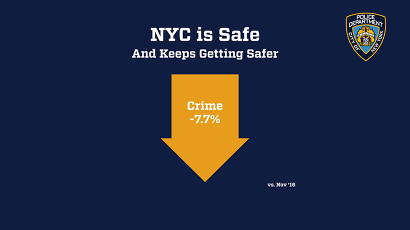

# Motivation 
The violent crime rate in U.S increased by 3.4 percent nationwide in 2016 in US. As an international student, as well as a New Yorker, the public safety in NYC is always a concern to us, especially after the recent terrorists attack near the World Trade Center. Thus, our group decided to make a deeper investigation of the crime data and seek out some underlying reasons which led to the increase of crime rate.

# Related work
The New York City Police Department provides overall crime dataset. NYPD also established a CompStat model, called [CompStat 2.0](https://compstat.nypdonline.org/2e5c3f4b-85c1-4635-83c6-22b27fe7c75c/view/89), providing greater specificity about crimes through an online interactive experience.

On the official website of new york city, there is also a [Crime Map](https://maps.nyc.gov/crime/) which enables people to view crime by precinct. This map includes crimes of seven major felonies.

# Data Description
NYPD official [website](https://www1.nyc.gov/site/nypd/stats/crime-statistics/historical.page) provides citywide histroic crime data in forms of excel. We downloaded these datasets and merged them into the nyc_crime_hist. The resulting data frame contain information about the total number of offenses from 2000 to 2016 and major offense categories(felony, misdemeanor, and violation) and detailed descriptions.