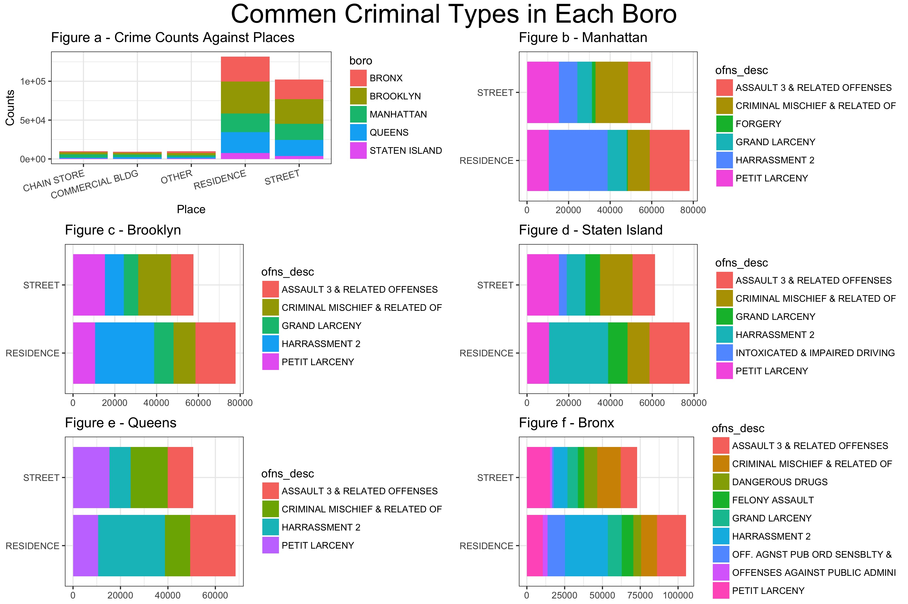

```{r, include=FALSE}
knitr::opts_chunk$set(echo = TRUE, collapse = TRUE, message = FALSE, warning = FALSE)
library(tidyverse)
library(rvest)
library(httr)
library(janitor)
library(lubridate)
library(readxl)
library(plotly)
library(forcats)
library(stringr)
theme_set(theme_bw())
```

# Motivation 
The violent crime rate in U.S increased by 3.4 percent nationwide in 2016 in US. As an international student, as well as a New Yorker, the public safety in NYC is always a concern to us, especially after the recent terrorists attack near the World Trade Center. Thus, our group decided to make a deeper investigation of the crime data and seek out some underlying reasons which led to the increase of crime rate.

# Related work
The New York City Police Department provides overall crime dataset. NYPD also established a CompStat model, called [CompStat 2.0](https://compstat.nypdonline.org/2e5c3f4b-85c1-4635-83c6-22b27fe7c75c/view/89), providing greater specificity about crimes through an online interactive experience.

On the official website of new york city, there is also a [Crime Map](https://maps.nyc.gov/crime/) which enables people to view crime by precinct. This map includes crimes of seven major felonies.

# Data Description
NYPD official [website](https://www1.nyc.gov/site/nypd/stats/crime-statistics/historical.page) provides citywide histroic crime data in forms of excel. We downloaded these datasets and merged them into the nyc_crime_hist. The resulting data frame contain information about the total number of offenses from 2000 to 2016 and major offense categories(felony, misdemeanor, and violation) and detailed descriptions.

```{r hist, echo=FALSE}
nyc_hist_vio = read_excel("./historic/violation-offenses-2000-2016.xls", range = "A4:R6") %>%
  mutate(ofns_type = "VIOLATION")

nyc_hist_felony_7 = read_excel("./historic/seven-major-felony-offenses-2000-2016.xls", range = "A5:R12") %>%
  mutate(ofns_type = "FELONY")

nyc_hist_felony = read_excel("./historic/non-seven-major-felony-offenses-2000-2016.xls", range = "A5:R13") %>%
  mutate(ofns_type = "FELONY")

nyc_hist_mis = read_excel("./historic/misdemeanor-offenses-2000-2016.xls", range = "A4:R21")%>%
  mutate(ofns_type = "MISDEMEANOR")

nyc_crime_hist = nyc_hist_mis %>%
  full_join(nyc_hist_felony) %>%
  full_join(nyc_hist_felony_7) %>%
  full_join(nyc_hist_vio) %>%
  mutate(ofns_type = as.factor(ofns_type), ofns_desc = OFFENSE) %>%
  select(-OFFENSE)
```

We focus our efforts on the data of current year 2017 which is obtained from [NYC_OpenData](https://data.cityofnewyork.us/Public-Safety/NYPD-Complaint-Data-Current-YTD/5uac-w243). It includes all valid felony, misdemeanor, and violation crimes reported to the NYPD till October in this year. The latest update of this dataset is October 25, 2017. 

```{r 2017, echo=FALSE}
nyc_crime_2017 = read_csv("./NYPD_Complaint_Data_Current_YTD.csv") %>%
  clean_names()

nyc_crime_2017 = nyc_crime_2017 %>%
  mutate(cmplnt_fr_dt = as.Date(cmplnt_fr_dt, "%m/%d/%Y")) %>%
  select(cmplnt_fr_dt, cmplnt_fr_tm, ky_cd, ofns_desc, law_cat_cd, boro_nm, prem_typ_desc, longitude, latitude) %>%
  filter(year(cmplnt_fr_dt)  == 2017) %>%
  rename(date = cmplnt_fr_dt, time = cmplnt_fr_tm, prem_typ = prem_typ_desc, ofns_type = law_cat_cd, boro = boro_nm)
```

# Data Exploration
## Map of crimes
Since the dataset has `r dim(nyc_crime_2017)` observations, we randomly sample 50000 observations to creat an interactive map showing locations where the crimes in New York City occured.

In future shiny app, we intend to add widgets that will limit the data size. The map will show crimes happening during a specfic date range or a specific boro.
```{r, echo = FALSE}
sample <- nyc_crime_2017[sample(1:nrow(nyc_crime_2017), 50000,replace=FALSE),]

sample %>%
  mutate(text_label = str_c("Offense desc:", ofns_desc, ' Boro: ', boro)) %>% 
  plot_ly(x = ~longitude, y = ~latitude, type = "scatter", mode = "markers",
          alpha = 0.5, 
          color = ~ofns_type,
          text = ~text_label)
```

## Crimes  analysis

### Analyzing the trend of crimes

The historic data shows the trend of crimes per month from 2000 to 2016. The crime number per month is calculated by dividing total crime number by 12 months (9 for 2017 since the data of 2017 is not complete yet). The results indicates that the prevalence of Misdemeanor is significantly higher than Violation and Felony.

We can see that overall the crime number per month are decreasing since 2000. However, misdemeanor crimes increased from 2005 to 2010, and dropped again after 2010.

```{r,echo=FALSE}
nyc_crime_hist = nyc_crime_hist %>%
  gather(key = year, value = count, "2000":"2016") %>%
  group_by(year, ofns_type) %>%
  summarize(crime_count = sum(count)/12) %>%
  full_join(nyc_crime_2017 %>%
  group_by(ofns_type) %>%
  summarize(crime_count = n()/9) %>%
  mutate(year = "2017")) %>%
  ungroup()

nyc_crime_hist %>%
  mutate(year = as.numeric(year)) %>%
  ggplot(aes(x = year, y = crime_count, color = ofns_type)) + geom_line() + geom_point()
```

Next, we made a plot showing the distribution of crime counts in 2017 based each months and grouped by boro. Overall, the crime counts keep at a stable level through this year except for the slightly fluctuation in the crime of Misdemeanor. 
```{r, echo=FALSE}
nyc_crime_2017 %>% 
  group_by(date, ofns_type) %>% 
  summarize(crime_count = n()) %>%
  ggplot(aes(x = date, y = crime_count, color = ofns_type)) + 
    geom_point(alpha = .6) + geom_smooth() + 
    theme(legend.position = "bottom")
```

Here, we would like to make a deeper investigation about the crime numbers and crime rate based on each month this year. In order to calculate the crime rate, we need to use the population data of NYC. We get this data from the [website](http://www1.nyc.gov/site/planning/data-maps/nyc-population/current-future-populations.page). We can see from the results that Brooklyn has the most crime numbers this year, but in crime rate, Bronx is the worst. Queens is relatively safer. Also, we could find that in February, there are usually fewer crimes, that's probably because the weather in February is usually the coldest, and people tend to spend more time indoors. The decreased outgoing times helps to account for fewer crimes in cold season.

```{r, echo=FALSE}
crime_tidy = nyc_crime_2017 %>% 
  mutate(month = month(date)) %>% 
  group_by(month,boro) %>% 
  summarize(crime_count = n())

crimetotal = ggplot(crime_tidy, aes(x = month, y = crime_count, color = boro)) + 
  geom_point() + geom_path(aes(group = boro)) +
  theme(legend.position = "bottom")

crime_rate = crime_tidy %>% 
  mutate(popluation = recode(boro, "BRONX" = 1455720,
                             "BROOKLYN" = 2629150,
                             "MANHATTAN" = 1643734,
                             "QUEENS" = 2333054,
                             "STATEN ISLAND" = 476015)) %>% 
  mutate(crime_rate = (crime_count/popluation)*100000)

crimerate = ggplot(crime_rate, aes(x = month, y = crime_rate, color = boro)) + 
    geom_point() + geom_path(aes(group = boro)) + 
    theme(legend.position = "bottom")

library(ggpubr)
ggarrange(crimetotal, crimerate, ncol = 2, common.legend = TRUE)
```
 
After analyzing the trend over year and month, a plot of crime count versus hour is also added. It clearly shows that crime usually happened during daytime. The peak of crimes is during 15:00 to 20:00. Between 3am and 8am, the crime numbers are relatively low.
```{r, echo=FALSE}
nyc_crime_2017 %>%
  mutate(hour = hour(time)) %>%
  group_by(hour, boro) %>%
  summarize(n = n()) %>%
  ggplot(aes(x = hour, y = n, color = boro)) + geom_point(alpha = 0.9) + geom_path(aes(group = boro),alpha = .5)
```


## Common crimes types in each boro  
In this part, we build a function to get the most prevalent crimes in each boro and illustrate the result.

```{r,echo=FALSE}
crime_type = nyc_crime_2017 %>%
    mutate(prem_typ=as.character(prem_typ),
           boro=as.character(boro),
           ofns_type=as.character(ofns_type),
           ofns_desc=as.character(ofns_desc))
    crime_type$prem_typ[grep("RESIDENCE",crime_type$prem_typ)] = "RESIDENCE"
    crime_type$prem_typ[crime_type$prem_typ==""]<-"OTHER"
    crime_type$prem_typ[grep("COMMERCIAL",crime_type$prem_typ)] = "COMMERCIAL BLDG"
```
 
```{r,echo=FALSE}
place_offense = function(x){
  crime_boro = crime_type %>% 
  filter(boro == x) %>%
  group_by(prem_typ) %>%
  summarize(crime = n()) %>%
  arrange(desc(crime)) %>% 
  top_n(4)
  top_place = crime_boro$prem_typ

  mat <- matrix(ncol = 3, nrow = 4)
for (i in 1:4) {
    offense_select = crime_type %>%
    filter(prem_typ == top_place[i],
           boro == x) %>%
    group_by(ofns_desc) %>%
    summarize(crime = n()) %>%
    arrange(desc(crime)) %>%
    top_n(3) 
    top_offense = offense_select$ofns_desc
    mat[i,] = top_offense
}
  mat <- cbind(top_place[1:4],mat)
  return(mat)
}
```

```{r,echo=FALSE}
boro = crime_type %>% distinct(boro) %>% pull()
place_offense_result = map(boro,place_offense)

boro_plot = vector("list", length = 5)
for (i in 1:5) {
df_boro = as.data.frame(place_offense_result[i])
df_boro = df_boro %>%
rename(place=X1,top_1=X2,top_2=X3,top_3=X4) %>%
gather(key=ofns_rank,value=ofns_desc,top_1:top_3) 
boro_ofns = unique(df_boro$ofns_desc)

boro_plot[[i]] = crime_type %>%
  filter(prem_typ %in% c("STREET","RESIDENCE"),
         ofns_desc %in% boro_ofns) %>%
  ggplot(aes(x = prem_typ,fill = ofns_desc)) + geom_bar() + coord_flip() + theme_bw() +
  theme(axis.title=element_blank()) 
}  

boro_plot[[1]]= boro_plot[[1]] + ggtitle("Figure b - Manhattan" )
boro_plot[[2]]= boro_plot[[2]] + ggtitle("Figure c - Brooklyn")
boro_plot[[3]]= boro_plot[[3]] + ggtitle("Figure d - Staten Island")
boro_plot[[4]]= boro_plot[[4]] + ggtitle("Figure e - Queens")
boro_plot[[5]]= boro_plot[[5]] + ggtitle("Figure f - Bronx")
```

```{r,include=FALSE}
library(gridExtra)
library(grid)
place_boro = crime_type %>%
  group_by(prem_typ) %>%
  summarize(crime = n()) %>%
  arrange(desc(crime)) %>% 
  top_n(5)
  top_place = place_boro$prem_typ
 
place_boro_plot = crime_type %>%
    filter(prem_typ %in% top_place) %>%
    ggplot(aes(x=prem_typ,fill = boro)) + geom_bar() + theme_bw() + theme(axis.text.x = element_text(angle = 15, hjust=1)) +
    labs(title = "Figure a - Crime Counts Against Places", 
    x = "Place",
    y = "Counts")

title = textGrob("Commen Criminal Types in Each Boro", gp=gpar(fontsize=25)) 
p = grid.arrange(place_boro_plot,boro_plot[[1]],
             boro_plot[[2]],boro_plot[[3]],
             boro_plot[[4]],boro_plot[[5]],
             ncol=2, top = title)

ggsave("Rplot1.jpeg", p, width = 12, height = 8, scale = 1)
```

```{r,echo=FALSE}

```
  
**Comments** 

*  In Figure a, we presented the top five places where crimes usually happlen across five boros in NYC and it shows that STREET and RESIDENCE are the most unsafe places, then we will look furtherly about the major crime types in these two places for each boro.  
*  We obtian the information of crime counts and types through the width and partitioning of bars. It is obviously to conclude that the prevalence of assault, harrassment and criminal mischief are much higher compared to other crimes in most boros.  
*  In residence, the occurence of harrassment and assult is more prevalent, while prtit larcency and criminal mischief represent more percentage of criminal types in street.  
*  Next, we want to compare the major criminal types in different boros. From Figure b-f, we found that the distribution of crimes are similar among Manhattan, Brooklyn, State Island and Queen. However, the characteristic of crimes in Bronx appeares to be more complex. Specificlly, the nature of crimes in Bronx is usually more serious than the other four boros, with the occurence of FELONY ASSAULT and DANGEROUS DRUGS, which belong to felony.  
*  Overall,the safty level in Manhattan, State Island and Queens in relatively higher

# Additional analysis
## Assoiciations between crime and income and between crime and unemployment

```{r, include = FALSE}
nyc_crime = read_csv("./NYPD_Complaint_Data_Current_YTD.csv") %>%
  clean_names() %>%
  select(boro = boro_nm)

crime_number = nyc_crime %>%
  group_by(boro) %>%
  summarise(n = n()) 

population = read_csv("./NYC_Population_by_Borough.csv") %>%
  mutate(boro = Borough) %>%
  select(-Borough)

nyc_crime_population = left_join(population, crime_number, by = "boro") %>%
  clean_names() %>%
  mutate(population = as.numeric(population)) %>%
  mutate(crime_rate = n / population * 100000)
```

```{r, echo = FALSE}
income = read_csv("./NYC_Income_by_Borough.csv") %>%
  clean_names() %>%
  mutate(boro = borough) %>%
  select(-borough)

crime_income = left_join(income, nyc_crime_population, by = "boro")

crime_income_plot = crime_income %>%
  ggplot(aes(x = income, y = crime_rate, fill=boro)) + geom_bar(stat="identity") +
  labs(title = "Crime Rate against Family Median Income",
       x = "Income Range",
       y = "Crime rate")
```

```{r, include = FALSE}
unemployment_rate = read_excel("./BoroMonth.xls", skip = 3) %>%
  clean_names() %>%
  select(boro, unemployment) %>%
  mutate(unemployment_rate = unemployment) %>%
  select(-unemployment)

unemployment_crime = left_join(unemployment_rate, nyc_crime_population, by = "boro")
```

```{r,include=FALSE}
unemployment_crime_plot = unemployment_crime %>%
  ggplot(aes(x = unemployment_rate, y = crime_rate, fill = boro)) + geom_bar(stat="identity") +
  labs(title = "Crime Rate against Unemployment Rate",
       x = "Unemployment rate",
       y = "Crime rate")

```


```{r,echo=FALSE}
ggarrange(crime_income_plot, unemployment_crime_plot, ncol = 2, common.legend = TRUE)
```

**Comments**  

*  In addition, we have a strong interest in finding potential factors that may associated with criminal rate. In this case, we firstly choose household income level by borough. It is surprising to find from the plot that both lower-income borough and higher-income borough have an extremely high crime rate.

For example, Bronx borough's family median income is 35176 dollars, associated with a crime rate of 5336.878. That is, we expect approximately 5337 crime cases among every 100000 people in bronx. Similarly, Manhattan borough's crime rate is 5184.963, which indicated that there are approximately 5185 crime cases among every 100000 people in Manhattan. In contrast, Family income ranged between 60000 dollars to 70000 dollars tends to have the lowerest crime rate. Taking Queens as an example, we expect only 2959 crime cases among every 100000 people, which has a crime rate of 2958.740.

Then, we studied deeply of the reasons behind the results. Why there's a significant difference of crime rate between each borough?

As for bronx, we think the main reason is the situation of lower income. Bronx family has the lowest median income among all five boroughs. The cost of living in New York City is expensive. People tend to need money for living, food, housing etc. However, facing with this problem, a proportion of lower income people would do illegal thing to make money. That can explain the reason why bronx has the highest crime rate.

As for Manhattan, the situation can be a little different as the family median income reaches 75575 annually. Therefore, the main reason of extreme high crime rate cannot be low income. According to our studies, we found that Manhattan's multiculturalism and multiracial can be a factor of high crime rate. Different people from different culture and background live in Manhattan. Sometimes, it is hard to get along with each other. As a result of it, conflicts may happen.

*  Secondly, we choose unemployment rate by borough as another potential indicator. After reading data from the web, data cleaning and data visualization, we can see the results from the scatter plot: Except for Manhattan (outlier), other four boroughs result shows that the higher unemployment rate, the higher crime rate. This conclusion is similar to our assumption.

Bronx has the highest unemployment rate of 6.6%, associated with the highest crime rate of 5336.878.

In contrast, Queens has the lowest unemployment rate of 4.3%, associated with the lowest crime rate of 2958.740.

However, this positive corelationship between unemployment rate and crime rate fails to explain the case of Manhattan with the unemployment rate of 4.4% and crime rate of 5184.963.


## Investigate offense description
We plot the top 10 words in of offense description:
```{r, echo=FALSE}
library(tidytext)

crime_words = nyc_crime_2017 %>%
  select(-longitude, -latitude) %>%
  mutate(ofns_desc = str_to_lower(ofns_desc),
         ofns_desc = str_replace(ofns_desc, "[2-3]",""),
  ofns_desc = as.character(ofns_desc)) %>%
  unnest_tokens(word, ofns_desc)

data(stop_words)

crime_word_tidy = 
  anti_join(crime_words, stop_words)


crime_word_tidy %>% 
  count(word, sort = TRUE) %>% 
  top_n(10) %>% 
  mutate(word = fct_reorder(word, n)) %>% 
  ggplot(aes(x = word, y = n)) + 
  geom_bar(stat = "identity", fill = "blue", alpha = .6) + 
  coord_flip()
```

The graph analyzes top 10 words showing in offense description. The most frequent one is larceny, which appears nearly 100000 times. Other frequent words including related, petit, assault, harrassment, etc. Most of them indicated the type of crime, which is consistent with what we expect. 


We compare distinct words in offense type of violation and felony.

```{r, echo = FALSE}
word_ratios = crime_word_tidy %>%
  filter(ofns_type %in% c("VIOLATION" , "FELONY")) %>%
  count(word, ofns_type) %>%
  group_by(word) %>% 
  filter(sum(n) >= 5) %>%
  ungroup() %>%
  spread(ofns_type, n, fill = 0) %>%
  mutate(
    violation_odds = (VIOLATION + 1) / (sum(VIOLATION) + 1),
    felony_odds = (FELONY + 1) / (sum(FELONY) + 1),
    log_OR = log(felony_odds / violation_odds)
  ) %>%
  arrange(desc(log_OR)) 


word_ratios %>%
  mutate(pos_log_OR = ifelse(log_OR > 0,  "felony_odds >violation_odds" ,"violation_odds > felony_odds")) %>% 
  group_by(pos_log_OR) %>%
  top_n(10, abs(log_OR)) %>%
  ungroup() %>%
  mutate(word = fct_reorder(word, log_OR)) %>%
  ggplot(aes(word, log_OR, fill = pos_log_OR)) +
  geom_col() +
  coord_flip() +
  ylab("log odds ratio (felony_odds/violation_odds)") +
  scale_fill_discrete(name = "") +
  theme(legend.position = "bottom")

```

The above chart compares distinct words(that is, words that appear much more frequently in one group than the other) in offense type of violation and felony. We can see that larceny, robbery, burglary,etc., appear more frequently in offense description of felony crime, while harrassment, gambling, loitering appear more frequently in offense description of violation crime. In terms of the results, we can obtain a basic picture of the difference between felony and violation. 

# Summary
Our analysis in focusing on providing information about crimes in NYC. The map helps to visualize where crimes occured in nyc. The trend of crimes shows the change over years and months. It also demonstrates that crimes are more likely to happen during afternoon and evening instead of mid night and early morning. Looking at different boros, we analyzed the common crimes in each boro. Bronx relatively has more crimes while Queens relatively is safest boro in NYC. Among all the criminal type, misdemeanor is the most frequently one. 

The information about crimes aroused our interest to ask what causes the difference in crime frequency. We collect the data about income and unemployment and analyze their association with crime rate. Since we only have 5 boros in nyc, there are not clear and strong evidence to show a significant relation.